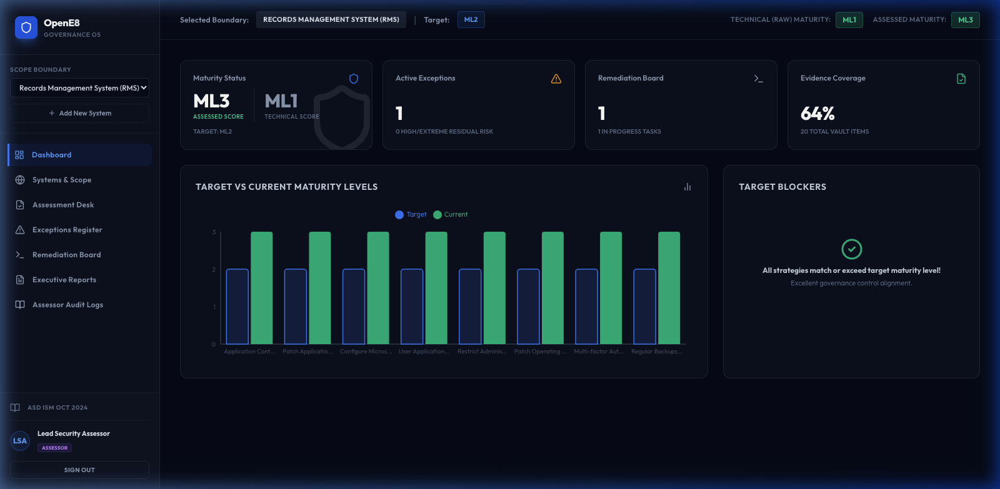

# OpenE8 Governance OS

> **Open-source Essential Eight governance, evidence, exceptions, and maturity management for Australian organisations.**



---

> [!NOTE]
> **Disclaimer**: OpenE8 is an independent open-source governance and evidence management platform for organisations implementing the ASD Essential Eight. It is not an official ASD tool, does not certify compliance, and does not replace a qualified assessor. It helps teams structure assessment scope, evidence, exceptions, remediation, and reporting.

---

OpenE8 sits **between technical evidence and governance decision-making** — modelling the entire governance chain as a structured workflow:

```text
System
  → Scope boundary
  → Target maturity level
  → Essential Eight strategy
  → Requirement
  → Evidence source (candidate finding or assessor-accepted)
  → Reviewer decision
  → Exception
  → Compensating control
  → Residual risk
  → Remediation task
  → Signed audit package
  → Report section
```

---

## Key Features

1. **Scope Builder**: Define systems, owners (business/technical), environments, data sensitivity (Official/Protected), out-of-scope assets, and risk justifications.
2. **Essential Eight Catalog**: A structured control catalog mapping requirements (ML1, ML2, ML3), expected evidence categories, test types, and ISM mapping IDs (October 2024 catalog — SHA-256 pinned on seeding).
3. **Evidence Vault**: Upload file evidence, API exports, manual attestations, and script logs with confidence scores, expiry tracking, review lifecycle states, and ownership.
4. **Technical Importers**: Parse Entra ID CA Policy JSON and Nessus scan CSV exports into structured **candidate findings** — reviewable by assessors before marking controls as passed or failed.
5. **Maturity Engine**: Calculates Technical Maturity (raw engineering result) and Assessed Maturity (reviewer-accepted result including approved compensating controls) using ASD's lowest-common-denominator model.
6. **Exceptions & Compensating Controls**: Track risk statements, alternate controls, compensating control efficacy, residual risk, approvals, rejection history, affected user counts, and review ownership.
7. **Remediation Board**: Interactive Kanban layout tracking tasks mapped to failed control items.
8. **Dual Sign-off Workflow**: Assessor and System Owner dual-signature sign-off seals assessment packages and locks all edits.
9. **Audit Trail Export**: Chronological audit log CSV exporter for regulatory handovers.
10. **Report Generator**: Assessment reports exportable in Markdown and JSON formats.

---

## Assessor Table View

Stage 4 (Compliance Review Desk) supports two views:

- **Graph View** — interactive evidence node graph showing requirement-to-evidence-to-mitigation traces
- **Table View** — flat, scannable assessor audit grid with per-requirement status, evidence count, reviewer, and notes; candidate findings are flagged with ⚠

---

## Directory Structure

```text
OpenE8/
  client/                   # Vite + React + Tailwind + Lucide + Recharts
    src/
      App.jsx               # Core Layout, Stepper, Evidence Graph, and Table View UI
      index.css             # Glassmorphism styling layers
    Dockerfile
  server/                   # Express + Prisma + SQLite
    prisma/
      schema.prisma         # Database relation schema
    src/
      server.js             # Express server and route mounting
      maturityEngine.js     # Decoupled compliance calculation logic (pure functions)
      authMiddleware.js     # PBKDF2 password hashing, HMAC-SHA256 JWT, requireAuth
      seed.js               # Mock database seeder
    tests/
      maturity.test.js      # Maturity engine unit tests
      auth.test.js          # Authentication and RBAC tests
      controllers.test.js   # Controller integration tests
      importers.test.js     # Importer candidate findings tests
  data/
    essential-eight/
      controls.json         # Control library requirements and mappings (Oct 2024)
  docs/
    README.md               # Project portal
    architecture.md         # System flowcharts and layer descriptions
    api-spec.md             # REST API payload contracts
    essential-eight.md      # Compliance calculation rules
    security.md             # Security design, threat model, and hardening checklist
    setup.md                # Onboarding environment setup
  docker-compose.yml        # Multi-container local orchestration
```

---

## Getting Started

### Prerequisites
- Node.js >= 18.0
- NPM >= 9.0

### Quick Setup

1. **Install Dependencies** (root, client, and server packages):
   ```bash
   npm run install:all
   ```

2. **Initialize Database Schema**:
   ```bash
   npm run db:setup
   ```
   This pushes the Prisma schema to SQLite and seeds demo governance data including two systems, pre-verified evidence, a catalog version record, user accounts, and audit logs.

3. **Launch Local Servers** (client on `http://localhost:3000`, API on `http://localhost:5001`):
   ```bash
   npm run dev
   ```

4. **Demo Accounts** (pre-seeded):

   | Role | Email | Password |
   |---|---|---|
   | Lead Security Assessor | `assessor@opene8.gov.au` | `Password123` |
   | System Owner | `owner@opene8.gov.au` | `Password123` |
   | Internal Auditor | `auditor@opene8.gov.au` | `Password123` |

> [!IMPORTANT]
> **SQLite is for local development only.** For production deployments, switch the Prisma datasource to PostgreSQL by updating `DATABASE_URL` in `.env` and running `npx prisma migrate deploy`. See [docs/security.md](docs/security.md) for the full production hardening checklist.

---

## Verification & Tests

```bash
npm test              # Run all test suites
npm run test:coverage # Run with statement coverage report (≥ 80% required)
```

Current coverage: **90.08% statements**, **97.36% functions**. All suites pass.

---

## Docker Compose Setup

```bash
docker-compose up --build
```

Client dashboard available at `http://localhost:3000`.

---

## Security

See [docs/security.md](docs/security.md) for the full security design document, including:
- PBKDF2 parameter justification (NIST SP 800-63B compliant)
- JWT threat model and known limitations
- Evidence integrity verification scope
- Importer candidate findings model
- Production deployment checklist

---

## References & Official Resources

For more details on the ASD frameworks implemented in this system, consult the official Australian Cyber Security Centre (ACSC) documentation:

- **ASD Essential Eight Maturity Model**: [Essential Eight Maturity Model](https://www.cyber.gov.au/resources-business-and-government/essential-eight/essential-eight-maturity-model)
- **ASD Information Security Manual (ISM)**: [Information Security Manual (ISM)](https://www.cyber.gov.au/resources-business-and-government/ism)
- **Essential Eight Explained**: [Essential Eight Explained](https://www.cyber.gov.au/resources-business-and-government/essential-eight/essential-eight-explained)

---

## License

Distributed under the Apache License 2.0. See `LICENSE` for details.
