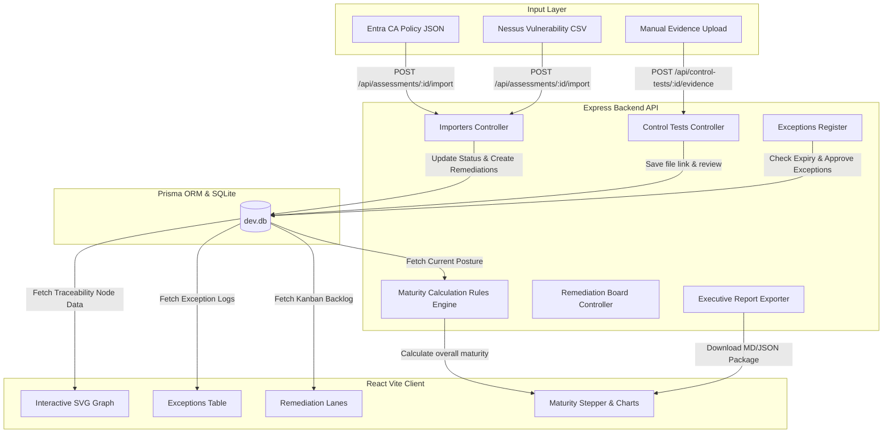

# System Architecture & Design

This document details the architectural boundaries, folder structure, database schema, and component layout of the OpenE8 Governance operating system.

---

## Technical Block Diagram

The following diagram illustrates how technical evidence (manual files, scan uploads, rule exports) enters the workspace, triggers calculations, and maps to the dashboard visualizer and reporting engines:



---

## Architectural Layout (Domain-Driven Design)

OpenE8 adheres to strict Domain-Driven Design (DDD) guidelines. All calculations, database transactions, and route operations are decoupled to maintain statement coverage and modular flexibility:

### 1. Decoupled Business Core
All compliance engine logic is isolated in [maturityEngine.js](../server/src/maturityEngine.js). It computes scores using primitive inputs (tests lists, catalog values, exception matrices) and executes without database hooks or express server dependencies. This ensures calculation code remains testable.

### 2. Delivery Independence
Routers (`server/src/routes/`) handle HTTP request inputs and parameter validation, immediately handing execution off to Controllers (`server/src/controllers/`) which manage ORM transactions and DB query bindings.

### 3. Folder Tree Structure
```text
OpenE8/
├── .agents/                    # Customization rules & skills
├── client/                     # React Vite client
│   ├── src/
│   │   ├── App.jsx             # Modular views, Stepper flow, SVG Node Graph
│   │   └── index.css           # Glassmorphism design tokens & styles
├── server/                     # Express API Server
│   ├── prisma/
│   │   └── schema.prisma       # Database model specifications
│   ├── src/
│   │   ├── controllers/        # Business logic controllers
│   │   ├── routes/             # Route configurations
│   │   ├── db.js               # Prisma Client orchestrator
│   │   ├── server.js           # API entry point & mounts
│   │   └── maturityEngine.js   # Score calculations engine
│   └── tests/                  # Deterministic integration/unit test scripts
```

---

## Database Schemas & Relations

Database schemas are defined in [schema.prisma](../server/prisma/schema.prisma) and map to a local SQLite instance during development. The key entities include:

- **System**: Represents the scoping boundary (Owner, sensitivity, platform, out-of-scope reasons).
- **Assessment**: Tracks a point-in-time compliance checkpoint.
- **ControlTest**: Evaluates a specific requirement status (e.g. `EFFECTIVE`, `ALTERNATE_CONTROL`, `INEFFECTIVE`, `NOT_APPLICABLE`).
- **Evidence**: Links technical config files to specific tests.
- **Exception**: Manages formal CISO risk approval logs, compensating controls, and expiration dates.
- **RemediationTask**: Schedules backlog tickets linked to failed controls to track patching SLAs.
- **AuditLog**: Records persistent, chronological change logs of assessor actions, including status diffs and audit comments.
