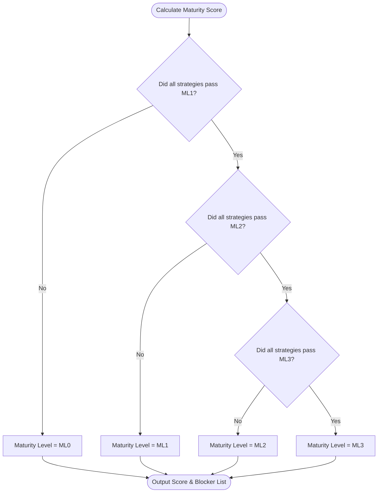

# Essential Eight Compliance Logic & ISM Mappings

This document details the compliance logic, score aggregation, exception overrides, and ISM control mappings utilized within OpenE8.

---

## Score Aggregation Logic (Lowest Common Denominator)

Under the Australian Signals Directorate (ASD) Essential Eight Assessment Guide, an organization's maturity is not calculated by averaging scores. The maturity score is calculated using the **Lowest Common Denominator** rule. 

To achieve Maturity Level $N$ overall, you must pass **every single requirement** associated with Maturity Level $N$ across all eight strategies. The flowchart below maps the calculation logic:

---

## Exceptions & Compensating Controls Override Gates

A major operational bottleneck for security teams is legacy systems or service accounts that cannot support modern security controls (like MFA or Application Whitelisting). 

OpenE8 resolves this bottleneck by implementing **Approved Exception Override Gates**:

1. **Approved Exception & Compensating Control Override**: If a control test fails (e.g. `E8-AC-ML1-01` is INEFFECTIVE) but there is an active, approved exception in the database, the engine treats it as a mitigating control if it satisfies the following rules:
   - **Efficacy Threshold**: The compensating control's efficacy rating must be assessor-rated as **`HIGH`**.
   - **Risk Acceptance**: A formal risk owner must accept the residual risk (`riskAcceptedBy` is signed and `riskAcceptedAt` timestamp is recorded).
   - **Expiry Verification**: The exception must be currently active (`status === 'APPROVED'` and `new Date(expiryDate) > new Date()`).
2. **Postures Split**:
   - **Technical Maturity (Raw Score)**: Computed strictly from technical passes without compensating overrides or exceptions.
   - **Assessed Maturity (Mitigated Score)**: Evaluated including CISO-approved compensating controls and active exceptions that satisfy the requirements above.

---

## Assessor Compliance Statuses

OpenE8 enforces structured, auditable statuses for requirement evaluations to ensure assessment credibility:

* **EFFECTIVE**: The control is fully verified and operating effectively.
* **INEFFECTIVE**: The control failed verification checks.
* **NOT_IMPLEMENTED**: The control is not implemented or partially configured.
* **ALTERNATE_CONTROL**: Alternate compensating controls have been verified to provide equivalent protection.
* **NO_VISIBILITY**: Insufficient evidence was gathered to verify the control.
* **NOT_APPLICABLE**: The requirement is out of scope with documented justification.
* **NOT_ASSESSED**: The requirement has not been assessed yet.

---

## Assessor Audit Logs

Every change event in the system scope is captured inside a persistent `AuditLog` table tracking:
- Action (CREATE, UPDATE, DELETE, IMPORT)
- Operator userId and Timestamp
- Affected Entity type and ID
- Diff comparison (old value vs. new value)
- Author review comment

---

## Evidence Confidence Scale

When evidence files are attached to a control review, assessors assign a confidence score:

- **HIGH (System-Generated Logs / Configuration Exports)**: Raw data extracted directly from system configurations (e.g., Active Directory policies, Entra CA JSONs, Nessus scans).
- **MEDIUM (Process Logs / Documentation)**: Written logs, system architecture screenshots, policy manuals.
- **LOW (Attestations / Email confirmations)**: Self-declarations, email threads, verbal attestations from developers.

---

<!-- BEGIN AUTOGEN: ism-mapping (generated by scripts/generate-ism-mapping.mjs — do not edit by hand) -->
## Essential Eight → ISM Mapping Index

> **Provisional starter mappings — not authoritative.** The `ISM-xxxx` references below are
> unverified candidates and have **not** been reconciled against the authoritative *Essential Eight
> Maturity Model and ISM Mapping (December 2023)*. Do not rely on them for a real assessment. See
> [`data/essential-eight/PROVENANCE.md`](../data/essential-eight/PROVENANCE.md) for source and status.
>
> This table is generated from `data/essential-eight/controls.json` by
> `scripts/generate-ism-mapping.mjs`. Edit the catalogue, not this file.

| Strategy | Req ID | Level | Provisional ISM mapping |
| :--- | :--- | :--- | :--- |
| Application Control | E8-AC-ML1-01 | ML1 | ISM-1507, ISM-1643 |
| Application Control | E8-AC-ML2-01 | ML2 | ISM-1508, ISM-1644 |
| Application Control | E8-AC-ML2-02 | ML2 | ISM-1509 |
| Application Control | E8-AC-ML3-01 | ML3 | ISM-1510, ISM-1511 |
| Patch Applications | E8-PA-ML1-01 | ML1 | ISM-1689, ISM-1690 |
| Patch Applications | E8-PA-ML2-01 | ML2 | ISM-1691 |
| Patch Applications | E8-PA-ML3-01 | ML3 | ISM-1692, ISM-1693 |
| Configure Microsoft Office Macro Settings | E8-OM-ML1-01 | ML1 | ISM-1654, ISM-1655 |
| Configure Microsoft Office Macro Settings | E8-OM-ML2-01 | ML2 | ISM-1656 |
| Configure Microsoft Office Macro Settings | E8-OM-ML3-01 | ML3 | ISM-1657, ISM-1658 |
| User Application Hardening | E8-UH-ML1-01 | ML1 | ISM-1400, ISM-1401 |
| User Application Hardening | E8-UH-ML2-01 | ML2 | ISM-1402 |
| User Application Hardening | E8-UH-ML3-01 | ML3 | ISM-1403, ISM-1404 |
| Restrict Administrative Privileges | E8-RP-ML1-01 | ML1 | ISM-1175, ISM-1176 |
| Restrict Administrative Privileges | E8-RP-ML2-01 | ML2 | ISM-1177, ISM-1178 |
| Restrict Administrative Privileges | E8-RP-ML3-01 | ML3 | ISM-1179 |
| Patch Operating Systems | E8-PO-ML1-01 | ML1 | ISM-1498, ISM-1499 |
| Patch Operating Systems | E8-PO-ML2-01 | ML2 | ISM-1500 |
| Patch Operating Systems | E8-PO-ML3-01 | ML3 | ISM-1501, ISM-1502 |
| Multi-factor Authentication | E8-MFA-ML1-01 | ML1 | ISM-1503, ISM-1504 |
| Multi-factor Authentication | E8-MFA-ML2-01 | ML2 | ISM-1505 |
| Multi-factor Authentication | E8-MFA-ML3-01 | ML3 | ISM-1506, ISM-1681 |
| Regular Backups | E8-RB-ML1-01 | ML1 | ISM-1512, ISM-1513 |
| Regular Backups | E8-RB-ML2-01 | ML2 | ISM-1514, ISM-1515 |
| Regular Backups | E8-RB-ML3-01 | ML3 | ISM-1516, ISM-1517 |
<!-- END AUTOGEN: ism-mapping -->

